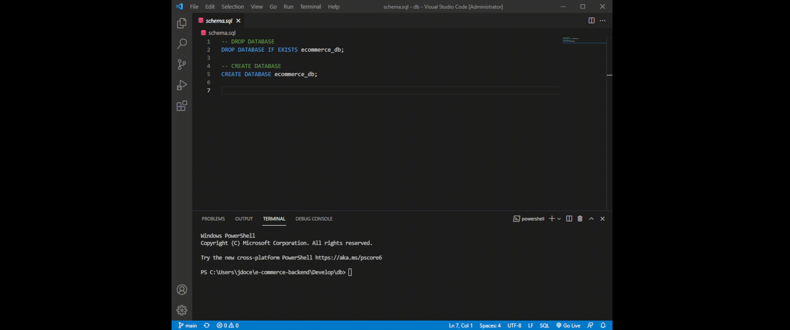
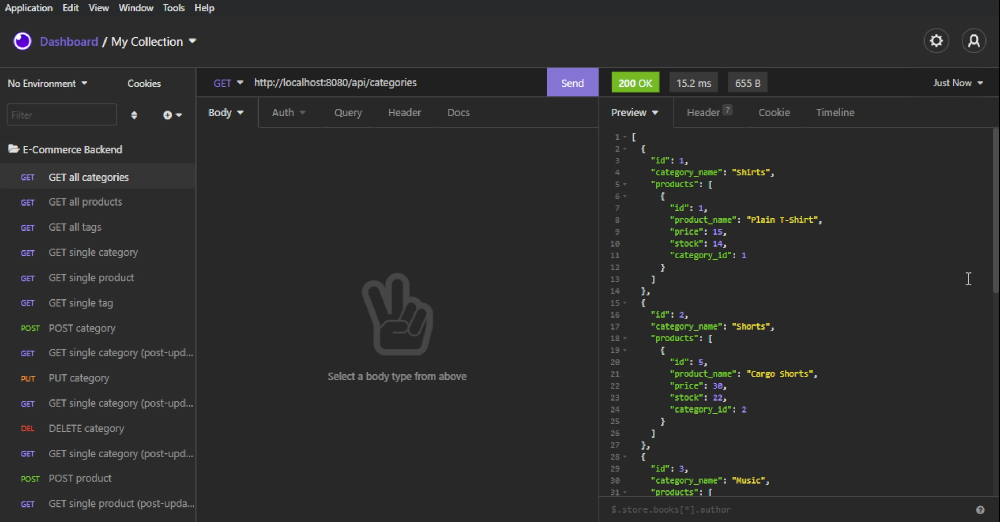

# E-Commerce Back End

## Description

Internet retail, also known as **e-commerce**, is the largest sector of the electronics industry, generating an estimated $29 trillion in 2019. E-commerce platforms like Shopify and WooCommerce provide a suite of services to businesses of all sizes. Due to their prevalence, understanding the fundamental architecture of these platforms will benefit you as a full-stack web developer.

This app provides the back end for an e-commerce site by modifying starter code. Utilising an Express.js API with Sequelize to interact with a MySQL database.

Because this application won’t be deployed, a walkthrough video that demonstrates its functionality and all of the acceptance criteria being met is provided.

## User Story

```md
AS A manager at an internet retail company
I WANT a back end for my e-commerce website that uses the latest technologies
SO THAT my company can compete with other e-commerce companies
```

```md
GIVEN a functional Express.js API
WHEN I add my database name, MySQL username, and MySQL password to an environment variable file
THEN I am able to connect to a database using Sequelize
WHEN I enter schema and seed commands
THEN a development database is created and is seeded with test data
WHEN I enter the command to invoke the application
THEN my server is started and the Sequelize models are synced to the MySQL database
WHEN I open API GET routes in Insomnia Core for categories, products, or tags
THEN the data for each of these routes is displayed in a formatted JSON
WHEN I test API POST, PUT, and DELETE routes in Insomnia Core
THEN I am able to successfully create, update, and delete data in my database
```

## Getting Started

Use the `schema.sql` file in the `db` folder to create your database with MySQL shell commands. Use environment variables to store sensitive data like your MySQL username, password, and database name.

You'll need to create the MySQL database as per this instructional video:



Then you should seed the data provided by executing the `npm run seed` command:


## Mock-Up

The following animation shows the application's GET routes to return all categories, all products, and all tags being tested in Insomnia Core:


The following animation shows the application's GET routes to return a single category, a single product, and a single tag being tested in Insomnia Core:


The following animation shows the application's POST, PUT, and DELETE routes for categories being tested in Insomnia Core:


These walkthrough videos also show the POST, PUT, and DELETE routes for products and tags being tested in Insomnia Core.

### Please refer to...

<a href="./Assets/Console-Routes.mp4">The Server Console video:</a>


<a href="./Assets/Insomnia-Routes.mp4">The Insomnia video:</a>



## Schema
### Database Models

The database contains the following four models, including the requirements listed for each model:

* `Category`

  * `id`

    * Integer.
  
    * Doesn't allow null values.
  
    * Set as primary key.
  
    * Uses auto increment.

  * `category_name`
  
    * String.
  
    * Doesn't allow null values.

* `Product`

  * `id`
  
    * Integer.
  
    * Doesn't allow null values.
  
    * Set as primary key.
  
    * Uses auto increment.

  * `product_name`
  
    * String.
  
    * Doesn't allow null values.

  * `price`
  
    * Decimal.
  
    * Doesn't allow null values.
  
    * Validates that the value is a decimal.

  * `stock`
  
    * Integer.
  
    * Doesn't allow null values.
  
    * Set a default value of `10`.
  
    * Validates that the value is numeric.

  * `category_id`
  
    * Integer.
  
    * References the `Category` model's `id`.

* `Tag`

  * `id`
  
    * Integer.
  
    * Doesn't allow null values.
  
    * Set as primary key.
  
    * Uses auto increment.

  * `tag_name`
  
    * String.

* `ProductTag`

  * `id`

    * Integer.

    * Doesn't allow null values.

    * Set as primary key.

    * Uses auto increment.

  * `product_id`

    * Integer.

    * References the `Product` model's `id`.

  * `tag_id`

    * Integer.

    * References the `Tag` model's `id`.

### Associations

Including the following associations on the Sequelize models to create the following relationships between them:

* `Product` belongs to `Category`, and `Category` has many `Product` models, as a category can have multiple products but a product can only belong to one category.

* `Product` belongs to many `Tag` models, and `Tag` belongs to many `Product` models. Allow products to have multiple tags and tags to have many products by using the `ProductTag` through model.

## License

Copyright <2021> <Jesse De Jong>

Permission is hereby granted, free of charge, to any person obtaining a copy of this software and associated documentation files (the "Software"), to deal in the Software without restriction, including without limitation the rights to use, copy, modify, merge, publish, distribute, sublicense, and/or sell copies of the Software, and to permit persons to whom the Software is furnished to do so, subject to the following conditions:

The above copyright notice and this permission notice shall be included in all copies or substantial portions of the Software.

THE SOFTWARE IS PROVIDED "AS IS", WITHOUT WARRANTY OF ANY KIND, EXPRESS OR IMPLIED, INCLUDING BUT NOT LIMITED TO THE WARRANTIES OF MERCHANTABILITY, FITNESS FOR A PARTICULAR PURPOSE AND NONINFRINGEMENT. IN NO EVENT SHALL THE AUTHORS OR COPYRIGHT HOLDERS BE LIABLE FOR ANY CLAIM, DAMAGES OR OTHER LIABILITY, WHETHER IN AN ACTION OF CONTRACT, TORT OR OTHERWISE, ARISING FROM, OUT OF OR IN CONNECTION WITH THE SOFTWARE OR THE USE OR OTHER DEALINGS IN THE SOFTWARE.